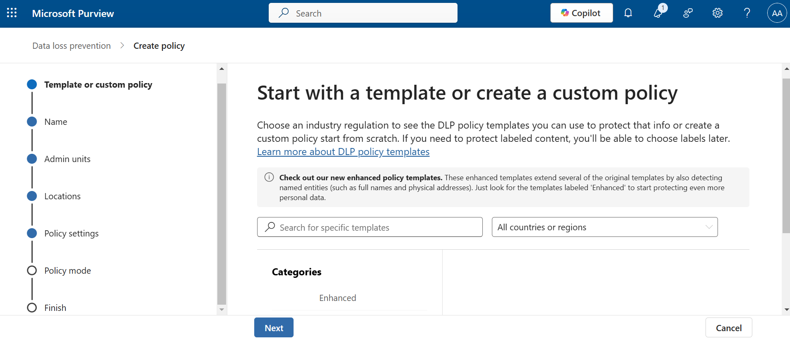
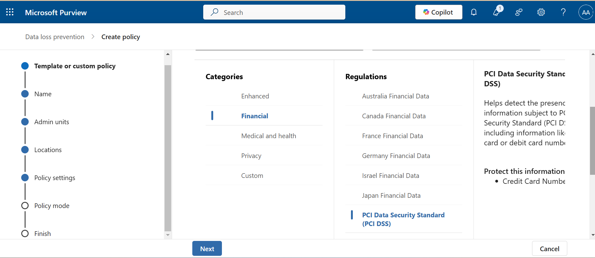
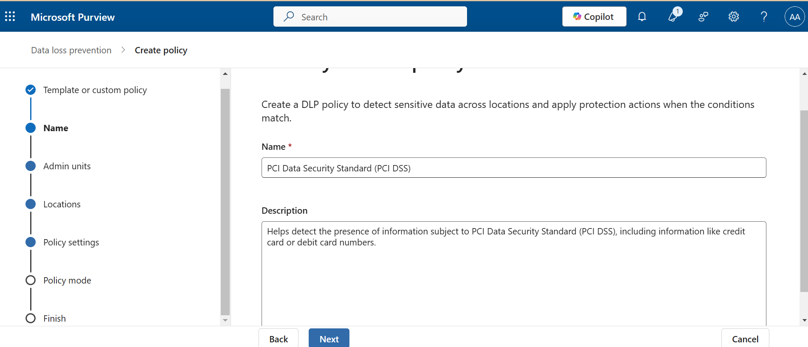
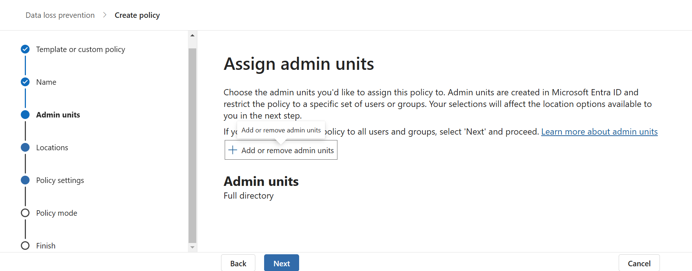
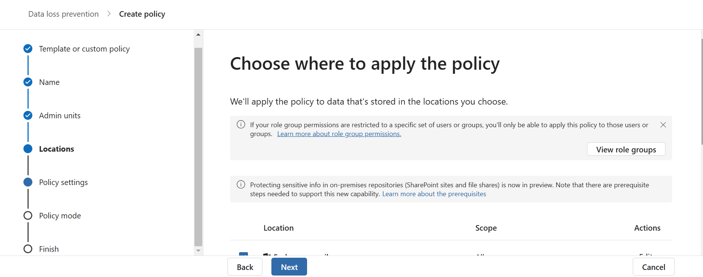
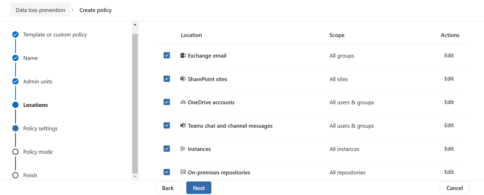
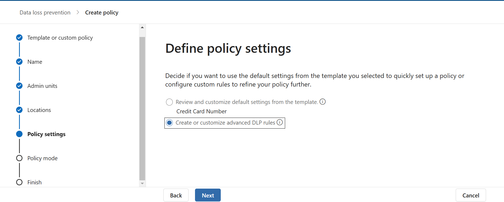
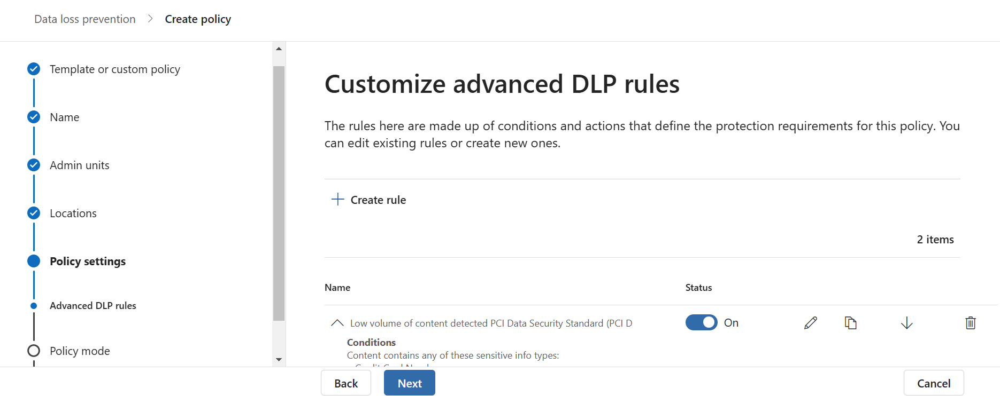
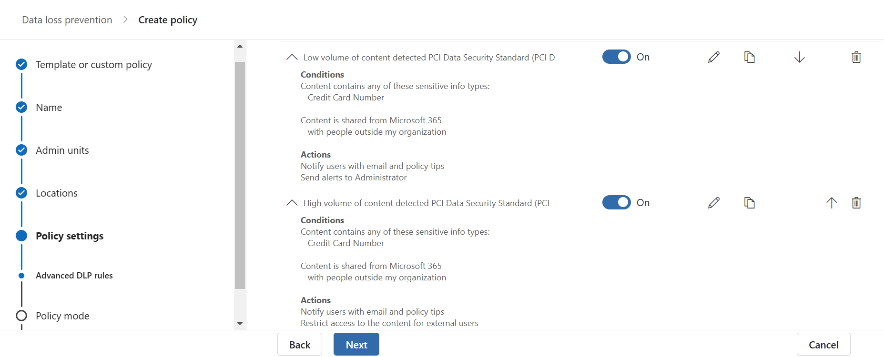
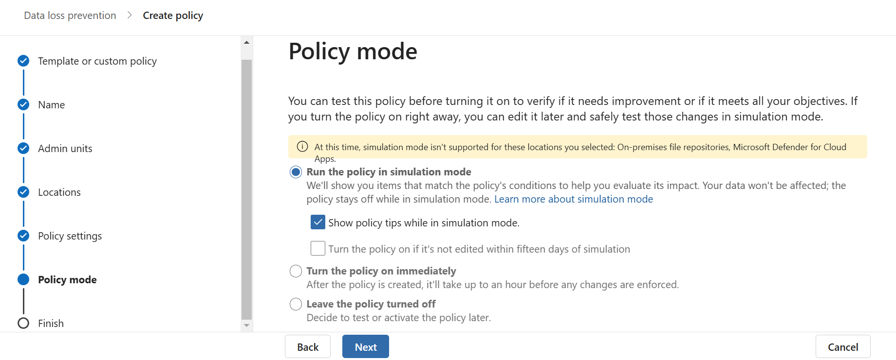

# Acme-s-DLP-Policy-Documentation
This document outlines the implementation of Acme’s Data Loss Prevention (DLP) policy using Microsoft Purview to protect sensitive financial, customer, and corporate information from unauthorized access, sharing, or exfiltration.

### Scope
The DLP policy applies to all sensitive information processed, stored, or transmitted across the following Acme systems and platforms:

- Exchange Email: Emails sent and received by employees, contractors, and partners.
- SharePoint Sites: Shared document libraries, collaboration sites, and sensitive information stored on SharePoint Online.
- OneDrive Accounts: Personal cloud storage accounts associated with individual employees and departments.
- Teams Chat and Channels: Instant messages, attachments, and conversations in Microsoft Teams, including group chats and channel discussions.
- Online Repositories: Cloud-based code repositories, document-sharing platforms, and other third-party integrations used in Acme’s operations.

### Key Features of the Policy
#### Sensitive Information Types:

- PCI DSS-related data (e.g., credit card numbers, CVVs).
- Personally Identifiable Information (e.g., SSNs, email addresses, passport numbers).
- Financial data (e.g., transaction details, account numbers).
- Corporate sensitive data (e.g., contracts, intellectual property).

#### Monitoring and Alerts:

- Automatic detection of sensitive data across all locations.
- Alerts sent to administrators for attempted unauthorized data sharing.
- Notifications to users when sensitive data-sharing attempts are blocked.

#### Actions and Enforcement:

- Automatically block sensitive data from being shared externally.
- Encrypt sensitive data in transit or at rest.
- Quarantine files that violate DLP rules for administrative review.

### Implementation Steps

#### Initiate the Policy Creation Process
Start by selecting a pre-defined template or crafting a custom policy based on organizational requirements.

#### Select the Appropriate Policy Template
Choose a template that aligns with your industry or regulatory needs. For this project, select the Financial template.
Within the Financial template, choose the relevant regulatory standard. For example, select the PCI DSS framework to address payment card industry compliance requirements.

#### Define Policy Name and Description
Provide a clear, concise name and detailed description for the policy to ensure its purpose is easily understood by stakeholders.

#### Assign Administrative Units
Designate specific administrative units or groups responsible for managing the policy, ensuring appropriate accountability and oversight.

#### Specify Applicable Locations
Identify the geographic or organizational locations where the policy will be enforced to ensure compliance across the relevant domains.

#### Configure Policy Settings
Define the core settings of the policy, including the scope, triggers, and enforcement levels, to meet organizational objectives.

#### Customize Advanced Data Loss Prevention (DLP) Rules
Tailor advanced DLP rules to address specific data protection needs, ensuring sensitive data is safeguarded against unauthorized access or exposure.

#### Modify Conditions and Actions
Fine-tune the policy by adjusting conditions and actions, ensuring precise alignment with regulatory and business requirements.

#### Run the Policy in Simulation Mode
Test the policy in simulation mode to evaluate its effectiveness, identify potential issues, and refine configurations before full deployment.

